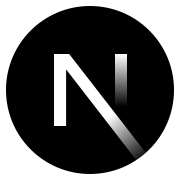

# Hi 👋! My name is Omar Obregon and I'm a Fullstack Developer, from Perú

I am a passionate Fullstack web development student with a strong interest in learning and applying the latest technologies and practices in the sector. My goal is to become a competent and versatile professional capable of handling both the frontend and backend of web projects.

###

    
    
    

###

  
  
  
  
  
  
  
  
  
  
  
  
  
  
  
  
  
  
  
  
  

###

  
  

